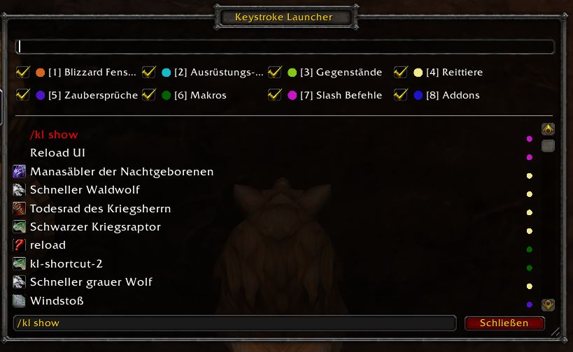

# Keystroke Launcher

Execute commands fast, no need to clutter your desktop with a lot of icons, just remember the name and execute it directly!

* **Fast and small footprint**
* **Frequency based search results**
* **Configuration UI**
* **Configurable look and feel**

Idea based on the awesome keystroke launcher for Windows [Keyperinha](http://keypirinha.com/).

## Quickstart

1. Press `ctrl+alt` to open the window
2. Type something
3. Press *Enter*, the first entry will be executed

To change the keybinding go into the configuration menu: `ctrl+alt` --> type in `kl` --> select `kl show` --> `Enter`

**Tipps:**

* Use the *Up/ Down* keys to select a different item. Or use the mouse abd clicking on it.
* Search database is refreshed once at login time. Can also manually be refreshed using the button in the configuration ui.

**How To:**

* [Associate a keyword to an item](docs/assoc.md)
* [Edit the search index or add new items](docs/edit.md)
* [Experimental: quick search type filter setting](docs/quick.md)
* [Experimental: automatic shortcut macros](docs/shortcut.md)

## The search index can contain

* (*) All spells which are castable and not passive
* All addons as long as they have a slash command registered and are enabled/ loaded
* All macros
* (*) A few additnioal commands like reload, logout, dismout, kl show
* (*) All inventory items which are usable
* (*) All mounts
* (*) Equipment Sets
* (*) Blizzard Unit Frames

(*) enabled by default, for the rest go into the configuration window.

## Gotchas& Known Issues

* Does not work in combat, due to Blizzard API limiations
* Needs one free slot in the "General" macro tab
* Addons are executed as `/(addon name in lower case)`, therefore will not work for addons with a diffent slash commands. Am not sure how to salve that atm.
* The way the autoscrolling works right now is very basic, it does not handle resizing or manual scrolling.

## Roadmap

* Add ability to execute subcommands, based on currently selected item
* Possibilty to modify the search index per GUI

Let me know if you find any bugs :)
