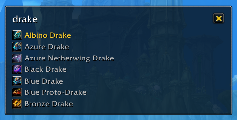

# Keystroke Launcher Resurrected

Search and use mounts, items, spells, addons, and more with a Spotlight-like launcher. Set a custom key combination (defaults to `Ctrl-Shift-P`) and get to things faster with just your keyboard. 

* Fast and small footprint
* Frequency based search results
* Configuration UI
* Configurable look and feel

## Quickstart

1. Press `Ctrl-Shift-P` to open the window
2. Type something
3. Press *Enter*, the first entry will be executed

To change the keybinding go into the configuration menu: `Ctrl-Shift-P` --> type in `kl` --> select `kl show` --> `Enter`

**Tips:**

* Use the *Up / Down* keys to select a different item. Or use the mouse abd clicking on it.
* Search database is refreshed once at login time. Can also manually be refreshed using the button in the configuration UI.

## Upgrading from Version 2 to Version 3

Version 3 brings an overhauled search UI, a host of bug fixes, and a more performant keybinding system.

If you were using Keystroke Launcher Resurrected before version 3, your existing keybind will be migrated to the new system, but if keybind doesn't work with WoW's built-in keybinding system, your keybinding will be reset. If your keybind no longer opens the Keystroke Launcher UI, you can either go set a new keybind by running `/kl show` and selecting the Keybind tab, or `/reload` your UI to set the keybind to the default (`Ctrl-Shift-P`).

## The search index can contain

* (*) All spells which are castable and not passive
* All macros
* (*) A few additnioal commands like reload, logout, dismout, kl show
* (*) All inventory items which are usable
* (*) All mounts
* (*) Equipment Sets
* (*) Blizzard Unit Frames
* All usable toys
* All addons as long as they have a slash command registered and are enabled/loaded

(*) enabled by default, for the rest go into the configuration window.

## Gotchas & Known Issues

* Addons are executed as `/(addon name in lower case)`, therefore will not work for addons with a diffent slash commands.

## Credits
Current Author: Peter Wooley <peterwooley@gmail.com>

Forked and expanded from [endymonium's terrific keystrokelauncher add-on](https://github.com/endymonium/keystrokelauncher)

Idea based on the awesome keystroke launcher for Windows [Keyperinha](http://keypirinha.com/). Does not work in combat, due to Blizzard API limiations. Needs one free slot in the "General" macro tab.
