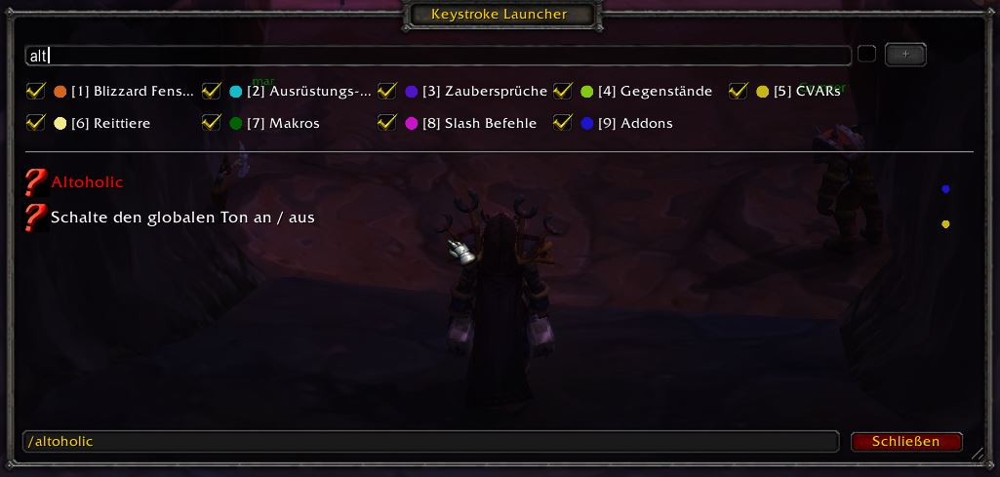
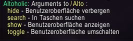
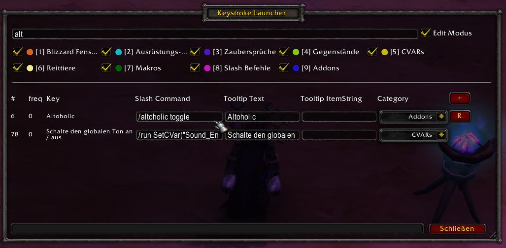

# Edit the search index or add new items

1. Let's try to open up the [Altoholic](https://www.curseforge.com/wow/addons/altoholic) addon. Open the keystrike launcher and enter `alt`

    

2. In the status bar you can see what the tool will execute: `/altoholic`. Either hit Enter or click on the icon to start it. You'll only get some messages in the console, because Altoholic needs some more parameters.

    

3. Make sure the edit mode is enables in the coniguration menu, then check the checkbox besides the search field, enter `alt` again, got to the "Slash Command" column and change it to `/altoholic toggle`. Then disable the edit mode, enter `alt` again and hit enter: the Altoholic window should now pop up.

    

**Notes:**

* When you change an entry, a `R` button will appear. Click that one to restore the orginal value.
* To add a completely new line, use the `+`. The `X` button let's you delete that new line again.