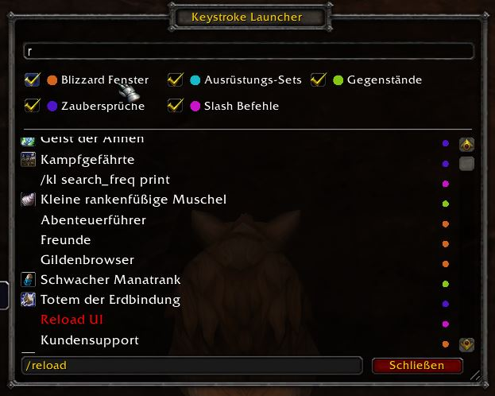
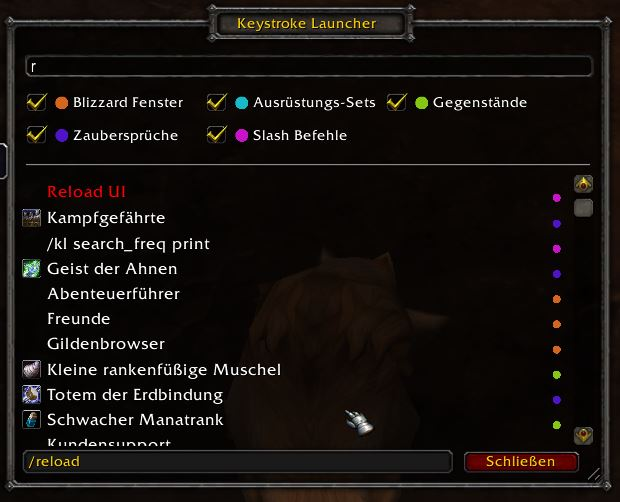
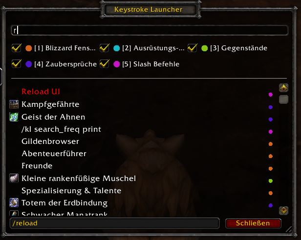
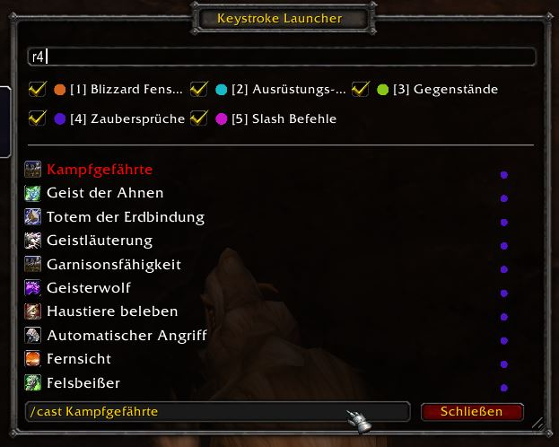

# How To

## Associate a keyword to an item

The tool implicitly associates a keyword with a particular item.

1. Enter a string, eg `r`. You can see that the `Reload UI` item is in the bottom of the visible result list.
    

2. Let's change that: use the *Up/ Down* keys to navigate to `Reload UI` and hit *Enter*.
    

3. After the ui reload, open the search window and enter `r` again. You can see that it is now the first result.
    

**Notes:**

* The other results below the first entry, are ordered by *total number of executions*.
* Association is done at execution time, that is, when you actually launch the item.
* You may want to associate `r` with an other item later. In that case, just type `r` and select this other item before executing it. The keystroke laucnher will change the association implicitly.

## Experimental quick search type filter setting

1. Enable the setting in the Look & Feel and read the notes carefully.
    

2. Open the search window and enter `r` as usual.
    

3. Now, let's say we want to limit the results for `r` to the search type category "Zaubersprüche" (spells). All we need to do now, is to press 4.
    